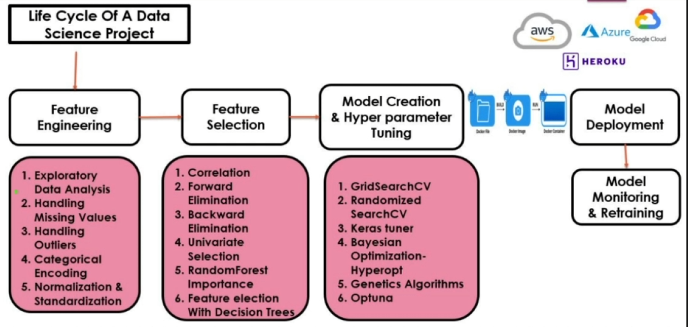

# MLOPS

### Life cycle os DS projects (agile)

1. requirements gathering: Domain expertise and POs, Business analyst
    - creating of sprints, dividing the work
  
2. Data analyst and dataScientist will discuss with POs to identifying the source of the data

3. Source could be APIs IOT Databases, etc

4. Engineering team will create a data pipeline (ETL)

### Train cycle

0. data ingestion, read data from source

1. Feature Engineering

2. Feature selection

3. model creation and training
   - experoment tracking, mlflow

4. model deployment

5. model monitoring and retraining

### DVC 
- Data versioning